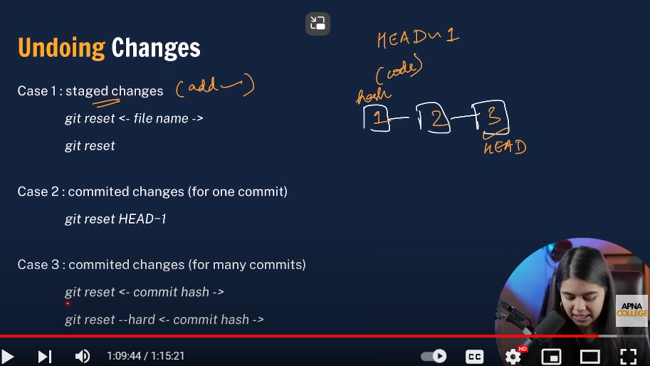

# Git-and-Github-Intro
Brief Intro of GIT AND GITHUB with basic commands and tutorial

## GIT
Version control system is a tool (software) that helps to track changes in code 
GIT is a version control system. It is 
- Popular
- free and open source
- fast and scalable

Used primarily to
- track the history : history of features or code in your project and can rollback to previos version of your project
- collaborate : when you collaborate in a team on a project, it is important to track on which features, what changes, whom has did it and which changes should be accepted in the production

## GITHUB  
Website that allows developers to store and manage their code using GIT.We upload the project in folders called Repositories(or Repo) on github. Also you can watch other people's repo's,clone and download it etc.

### Step 1 - Create Repo

You will see a readme.md file once a repo is created

**Readme** file is stored as Readme.md where `".md"` stands for `markdown`, there is a message against the README.md file on slight right, upon initial setting up of repo, this will always contain the message `"initial commit"`

You can go on the edit option, do some editing and select commit changes. You may additionally add a message while doing this change which will reflect on the repo as well


### Step 2 - Setting up GIT
1. Download VS CODE
2. Download GITBASH (ON WINDOWS) / TERMINAL (ON MAC)

Once installed, check for git version using git bash
> `git --version`
This will output the version and will confirm installation of git on your system

You can also run a few scripts like `ls` - This will output all the folders and files in your current directory, `pwd` - will provide current directly path, '`clear` - to clear output on the git bash terminal, `-Get-ChildItem -Force` - to get all the items in current directory including the hidden ones or alternatively use `dir -Force` for the same command.


### Step 3 - Configuring GIT
Telling GIT which account do we need to make changes on github

1. Setting USER NAME
- `git config -- global user.name "Your_User_Name`

2. Setting EMAIL
- `git config -- global user.email "email_address`

3. To check the status of setup
- `git config --list`

### <span style= 'color:red'>You can also use the git commands in your VS CODE Terminal </span>

### GIT COMMANDS
1. clone - cloning a repository on our local machine
  - `git clone <-some link>`
  - Go to your repo, click on code button (in green) select HTTPS block and copy the link there and use that link in the clone command to copy your repo in local machine

2. status - display the state of your code
  - `git status`
  - Suppose you have made some changes in your project (in any file), and saved it, then although the changes have been made locally in the system, they will not reflect on the github repo. When you use the `git status` command, it will reflect which files have been changed or modified, are they up-to-date or require some additional operations.

    Whenever you modified or changed somethin in your project, from there it is a two step process : 
    1. Add 
    2. Commit
    If you do not use these two commands, the status will keep on showing there are some modified files in the project

    There are 4 kinds of statuses that `git status` will show
    1. Untracked - You added a new file, saved it but haven't added and commit it to the main brand
    2. modified - some changes in the previously present files in repo
    3. staged - file is added but not committed in the repo
    4. unmodified - unchanged

4. Add - adds new or changed files in your working directory to the GIT staging area
  - `git add <file_name>` or you can use `git add . (remember to provide a space characted between add and .)`

5. commit - it is the record of change
  - `git commit -m "some message" 

        ### At this step, I have made some changes in the README.md file and added a new file called helloworld.py and following is the status changes occuring as I proceed and the order of how we need to process these commands
        ```
          PS C:\Users\rahul gupta\Documents\Learning\Git and Github\Git-and-Github-Intro> git status
        On branch main
        Your branch is up to date with 'origin/main'.

        Changes not staged for commit:
          (use "git add <file>..." to update what will be committed)
          (use "git restore <file>..." to discard changes in working directory)
                modified:   README.md

        Untracked files:
          (use "git add <file>..." to include in what will be committed)
                helloworld.py

        no changes added to commit (use "git add" and/or "git commit -a")
        PS C:\Users\rahul gupta\Documents\Learning\Git and Github\Git-and-Github-Intro> git status
        On branch main
        Your branch is up to date with 'origin/main'.

        Changes not staged for commit:
          (use "git add <file>..." to update what will be committed)
          (use "git restore <file>..." to discard changes in working directory)
                modified:   README.md

        Untracked files:
          (use "git add <file>..." to include in what will be committed)
                helloworld.py

        no changes added to commit (use "git add" and/or "git commit -a")
        PS C:\Users\rahul gupta\Documents\Learning\Git and Github\Git-and-Github-Intro> git add helloworld.py
        PS C:\Users\rahul gupta\Documents\Learning\Git and Github\Git-and-Github-Intro> git status
        On branch main
        Your branch is up to date with 'origin/main'.

        Changes to be committed:
          (use "git restore --staged <file>..." to unstage)
                new file:   helloworld.py

        Changes not staged for commit:
          (use "git add <file>..." to update what will be committed)
          (use "git restore <file>..." to discard changes in working directory)
                modified:   README.md

        PS C:\Users\rahul gupta\Documents\Learning\Git and Github\Git-and-Github-Intro> git add README.md
        PS C:\Users\rahul gupta\Documents\Learning\Git and Github\Git-and-Github-Intro> git status
        On branch main
        Your branch is up to date with 'origin/main'.

        Changes to be committed:
          (use "git restore --staged <file>..." to unstage)
                modified:   README.md
                new file:   helloworld.py

        PS C:\Users\rahul gupta\Documents\Learning\Git and Github\Git-and-Github-Intro> git commit -m "NEW- Updated Files"
        [main 8f7941d] NEW- Updated Files
        2 files changed, 17 insertions(+), 4 deletions(-)
        create mode 100644 helloworld.py
        PS C:\Users\rahul gupta\Documents\Learning\Git and Github\Git-and-Github-Intro>
        ```
6. push - upload local repo content to remote repo
  - `git push origin main`
  - Here origin is used as an alias for the remote repo present on github
  - main refers to the branch

7. init - Used to create a new git repo. Suppose we have a new project that we start working on in our local machine only and then we want to create a new repo and use git to create this new repo and push or do other operations on github
  a. `git init`
  (For this step, I have created a local folder called `local_repo` in my machine using `mkdir <folder_name>` command in terminal )
  now ran `git init` command to make this a **git repo**, to confirm, check the hidden files which should contain a `.git` folder

  Now I have created 1 python file in this local_repo, now to push this file on our github, you need to create a new repo,I am creating this new repo with name new_repo_git_github

  b. `git remote add origin <link>` - So that we can add the local repo to the github remote repo by providing its link. Also from now on, we will refer to this repo as **"origin"** from now on.
  c  `git remote -v` - to cross check which repo are we currently referring to here. It should return the repo link of the one which we are currently using.
  d. `git branch` - to check branch
  e. `git branch -M <new_name>` - to change the name of the current branch
  f. `git push -u origin main` - Although we could ignore "-u" but this will help git to always use origin repo main branch whenever we do push operation next time so we don't have to specifiy repo and branch and just use `git push` the next time.

8. Changing git origin - You can change the repo to which "origin" is refering to 
  - `git remote set-url origin <repo HTTPS link>`
  
## WorkFlow
When working with Local Git follow the following workflow 
> Create Github Repo -> clone -> do changes as per your project -> add -> commit -> push
## Git Branches
You can think of Github branches as part of project carved out by different teams working on different functionalities of project, forming a sort of tree structure where your main branch or tree is your whole project, sub branches are teams like frontend,backend, database, testing etc.

Idea is that if many developers are working at a time on project, no one should wait for others to complete their tasks to start performing their own, instead, they make a copy or carve out some of the project feature or code then work on it. Once one completes it's task, they then merge the branch with the original main branch.

### Branch Commands
1. `git branch` - To check current branch
2. `git branch -M <new_name>` - to rename branch
3. `git checkout <other branch name>` - to navigate to some other branch
4. `git checkout -b <new_branch_name>` - to create a new branch. When you run git branch command after this, you can see other branches with current one highlighted in some color
5. `git branch -d <branch_name>` - to delete branch **but you cannot delete the branch you're currently on**

> #### NOTE - When you create some changes into a new branch, it won't reflect in your other branches, so for representation, i have made some changes in my helloworld.py file which are present in feature1 branch but not on main, so when you switch to your main branch, the changes wont be reflected.<br>

> #### Now what we will do is to push the changes in our github repo on our feature1 branch only using `git push origin feature1` command. This will create another branch feature1 on our github repo with new implementations. Now suppose you want the changes that are made in feature1 branch to be committed in your main branch, for that you need to merge those branches


### Merging code 
There are 2 ways to do that

1. using git

- `git diff <branch_name from which we need to see the diff>` - to compare commits, branches files and more from current to another one. Press `q` to exit the difference section on terminal

- `git merge <branch_name in which we need to merge>` - to merge 2 branches (currently it will show different in helloworld.py file, the code or line in red means it is removed and green means, its added)

2. Create a PULL REQUEST (PR) - It lets you tell others about changes you've pushed to a branch in a repo on GITHUB.

Although it's better to use PULL REQUEST when working in team environment since, it is possible that every time you create some feature in some other branches apart from main, senior developers review your code before merging the features into the main branch


### Pull Command
Sometimes, when you make changes in the github repo directly, like merging the pull request, changes in some readme etc, those changes will only reflect on github but won't reflect on your local machine, to make the changes done in repo visible on your local system, you can use 
pull command

- `git pull origin main`

### Resolving Merge Conflicts
An event that takes place when Git is automatically unable to resolve differences in code between two commits
Suppose you commit some changes in branch "A" and commit some changes at exactly same place in branch "B" and try to merge those two, Git won't be able to automatically merge those files. NOTE THAT THOSE CHANGES SHOULD BE COMMITTED IN BOTH THE BRANCHES AT THE SAME PLACE.

There are certain ways, like keep commits from one particular branch, keep changes from both in two separate lines or no changes

### UNDOING CHANGES

Case 1 - Staged changes (When you added the changes but have not committed them)
- `git reset <file_name with extension>`
- `git reset` in case if we need to reset changes in many files

Case 2 - Commited changes 
- `git reset HEAD~1` it will take you before the add stage where you just saved the changes in your local machine by **1 commit**.
You can also use `git log` to view all the commits


Case 3 - Commited changes (for many commits)


- `git reset <commit hash>`  - hash is the highlighted id in the git log
- `git reset --hard <commit hash>`


